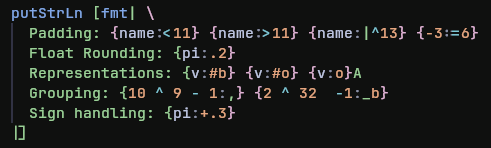

# tree-sitter-pyf

A grammar for the PyF QuasiQuote.

Do note that this is very rudimentary and was made mostly for learning Tree-Sitter.

## Example Highlights


## Installation

Place this somewhere in your config and run `:TSInstall pyf`
```lua
local parser_config = require("nvim-treesitter.parsers").get_parser_configs()
parser_config.pyf = {
    install_info = {
            url = "https://github.com/Perigord-Kleisli/tree-sitter-pyf.git", 
            files = {"src/parser.c", "src/scanner.c"},
            branch = "main",
        },
    filetype = "pyf",
}
```

For the highlighting and injections, copy `queries` to the first path in `:lua =vim.api.nvim_list_runtime_paths()` (most likely `~/.config/nvim`). If the files in `queries/` already exist, instead append the contents to your already defined queries.
